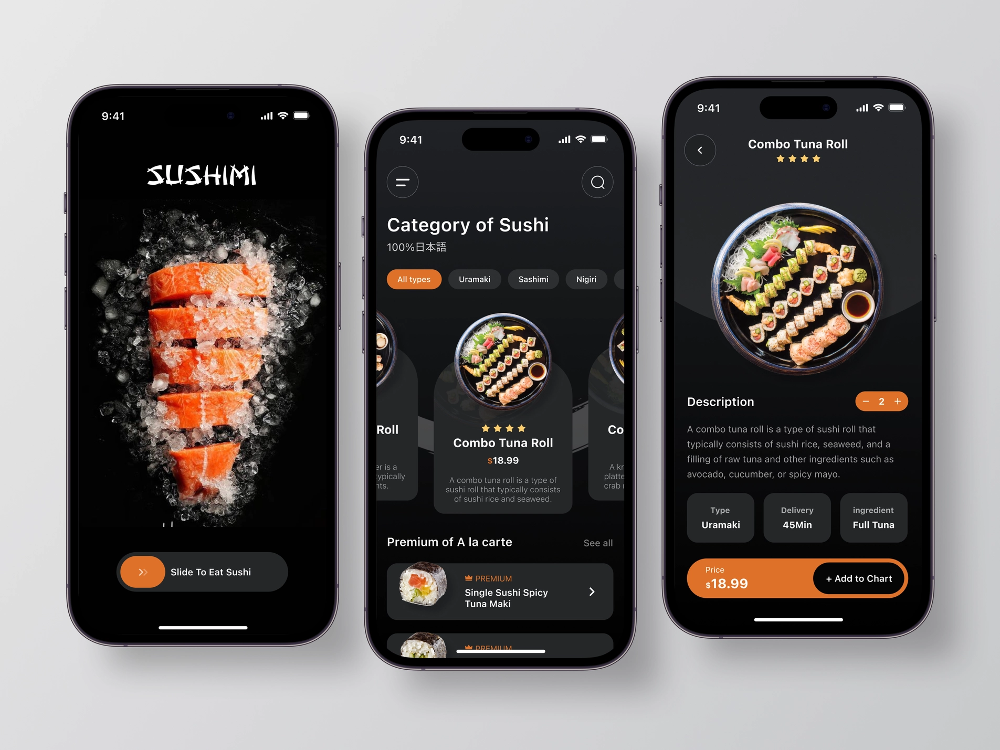

# Foodies 🍔

Foodies is a food delivery mobile app built using React Native and Tailwind CSS. The app provides a user-friendly interface for customers to order food from their favorite restaurants. With its intuitive design, users can easily browse through menus, select items, and place orders.
Foodies is a fully functional app that is built with <b>React Native</b>, <b>Firebase CMS</b>, and <b>Tailwind CSS</b>. It is a responsive app that works seamlessly on both <b>Android</b> and <b>iOS</b> platforms.

### UI/UX Design 🎨

&copy; 2023 - <b>Foodies</b> - All Rights Reserved.
